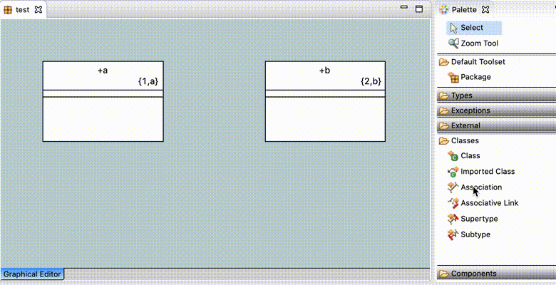

= Automatically formalize and force user to setup referentials and role phrases at creation

xtUML Project Analysis Note

== 1 Abstract

Want to automatically formalize relationships when they are drawn and force the
user to set up referentials and role phrase at creation time.

This comes from a Nov 17, 2018 discussion between One Fact and users about
high-priority items.

== 2 Introduction and Background

One difference between BridgePoint and iUML highlighted at xtUML Days 2017 is
UI work flows. BridgePoint tends to provide an editing experience that focuses
on individual model changes -- renaming, adding elements, changing individual
property values of model elements. iUML focuses on more cohesive editing actions
-- creating an attribute includes specifying its type, optionally adding it to
an identifier, etc. Creating a relationship includes formalizing the
relationship, specifying cardinality and role phrases, etc. iUML does not allow
users to create an attribute and then add it to an identifier. These are done in
one action. Model elements may be edited after the fact, but it is always in the
context of the larger modeling action.

== 3 Requirements

=== 3.1 BridgePoint shall support formalizing associations at relationship creation time.

==== 3.1.1 This mechanism may be enabled or disabled through a workspace preference.

=== 3.2 The design of the automatic formalization mechanism shall be designed for general utility.

==== 3.2.1 The mechanism shall be accessible to edit existing relationships.

==== 3.2.1 The mechanism shall be designed to facilitate reuse and future enhancement.

=== 3.3 The mechanism shall support enforcement of certain modeling standards.

==== 3.3.1 The enforcement rules may be configured through workspace preferences.

==== 3.3.2 Role phrases may be configured to be required or optional.

=== 3.4 Reasonable defaults shall be provided for all new workspace preferences.

== 4 Analysis

4.1 Workflow support

BridgePoint currently uses a mechanism to generate UI workflows as Eclipse
wizards. Actions that require multiple inputs or steps can be defined using a
combination of PEI data and special OAL functions. Invocations to a special EE
("User") are used to map to user interactions such as selecting elements from a
drop down menu or entering text. Archetypes generate wizard implementations and
menu entries based on the PEI data and parsed OAL instances. This mechanism can
be reused to easily create a variety of operations. It could also be modified to
generate any flavor of UI element. For example, instead of wizards, it could be
changed to support a workflow in a single dialog or even an editor pane.

4.2 Element creation

During element creation, special OOA of OOA functions are invoked to initialize
a new element. These functions could be used to hook into existing UI workflows.
The special functions are marked by a indicator in the description field. With
some special generation rules these functions can be invoked directly from OAL
and therefore it would be trivial to trigger one on creation of an element (just
invoke it in the same OAL activity that is used to create the instance). Since
workspace preferences are also accessible from OAL through a bridge, it is
trivial to gate the automatic invocation of these functions with preferences.

4.3 Workflow generation pitfalls/short comings

A full relationship editor is quite a bit more complex than any UI workflow so
far in BridgePoint. This section enumerates the shortcomings of the generation
process and where it would need to be changed to support such a workflow.

4.3.1 Strong model data/generation coupling

Over time the archetypes used to generate UI workflows have become strongly
coupled to the data used to generate those workflows. The result is a generation
flow which is very specific to the current UI workflows. For example, some of the labels
for the relationship formalization actions are hard coded directly into the
archtypes. This makes the workflow generation considerably less flexible for use
with new workflows.

4.3.2 Handwritten code

In addition to 4.3.1 for some of the more complex workflows, handwritten code is
required for certain pages of the wizards. This can potentially be a "good"
thing from the perspective of adding new workflows as it adds flexibility to the
mechanism, however it means that less of the code is generated than would be
ideal.

4.3.3 Conclusion

It is not immediately clear how much work will need to be done in order to
repair the workflow generation support.  For the purposes of this analysis, a
rough estimate has been made, however more analysis will be required
before/during the design phase. The workflow generation is an incredibly
powerful tool, therefore it is highly desirable to "rescue it" and enhance it
for future use. "TODO" items (not an exhaustive list):

* Tease apart archetypes and data. Try to repair/remove as much special casing
  as possible
* Enhance the workflow model to be able to represent a broader variety of
  workflows (helps avoid special casing)
* Add bridges to the "User" EE to support a wider range of user inputs (e.g.
  free form text input)

4.4 Relationship types

BridgePoint supports three different types of relationships between classes:
simple (binary), Subtype/supertype (generalization), and associative (linked).
These can only be created on the canvas via a tool found in the palette. Tools
exist for creating simple relationships, subtypes and supertypes. A
subtype/supertype relationship is created by first drawing a supertype arrow
from the supertype  class into space, then by drawing a subtype line from the
subtype class to the arrow. More subtypes can be added to the relationship by
drawing subtype lines to the arrow from another class. Linked relationships are
created by first drawing a simple relationship and then adding the associative
class to the relationship by drawing a link (dotted line) from the associative
class to the existing relationship line. This caused BridgePoint to migrate
relationship from simple to linked. See the figures below for clarification.

.caption Creating a simple relationship

.caption Creating a sutype/supertype relationship

.caption Creating a linked relationship

4.4.1 Simple relationships

Simple relationships can be easily handled by bringing up the relationship
editor mechanism as soon as the line is drawn between the two classes

4.4.2 Subtype/supertype relationships

Subtype/supertype relationships can be handled by the relationship editor when
the first subtype line is drawn to a supertype arrow. Any subtypes added to the
relationship after the fact can be automatically formalized using the existing
properties of the relationship. BridgePoint already supports automatically
formalizing additional subtypes when added to an existing subtype/supertype
relationships.

4.4.3 Linked relationships

Linked relationships cannot be handled as they are today because the require
creating a simple relationship and migrating to a linked relationship. A new
solutions is necessary.

4.4.3.1 Relationship creation with a CME

The ability to create a relationship with a CME could be added. If exactly three
classes/imported classes in the same package are selected, a new item to create
a linked relationship could be enabled. This would activate the relationship
editor.

This mechanism could be extended to support simple and subtype/supertype
relationships as well. It has the added benefit of giving the user the ability
to create relationships between classes from the model explorer and breaks
dependency on the palette and the canvas.

4.4.3.2 Specialized palette tool

A new tool could be created specifically for linked relationships. This tool
could require the user to drag from one class to another then to a third class
before release to create a linked relationship. Alternatively, drag from one class to
another and release then drag from a third class to the line. If this sequence
is not performed, the creation is aborted.

If this path is taken, the "Associative Link" tool in the palette should be
removed.

== 5 Work Required

5.1 Repair and enhance workflow generation support.

5.2 Implement a relationship editor as a workflow.

5.3 Introduce new mechanism for creating linked relationships directly.

5.4 Hook the editor in to creation of relationships.

5.5 Handle workspace preferences and defaults.

5.6 Test and verify requirements are met.

5.7 Add/modify user documentation where necessary.

== 6 Acceptance Test

6.1 Acceptance tests to verify each requirement shall be defined during the
design phase.

== 7 Document References
. [[dr-1]] https://support.onefact.net/issues/11556[11556 - Automatically formalize and force user to setup referentials and role phrases at creation]

---

This work is licensed under the Creative Commons CC0 License

---
