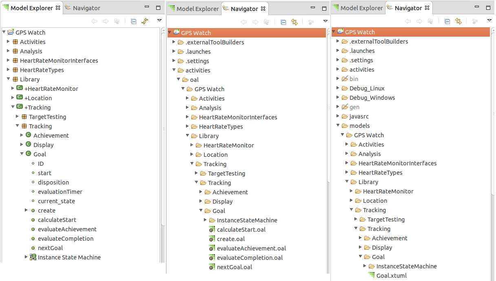

---

This work is licensed under the Creative Commons CC0 License

---

# Storing Action Semantics as Files
### xtUML Project Analysis Note

1. Abstract
-----------

Currently, BridgePoint stores action language in an attribute on model
instances in the meta-model. This approach has a few key disadvantages:
* Mixing of concerns between the models and the actions
* Not easily extensible to support multiple dialects of action language
(think OAL, MASL, ALF)

Moving to a file based strategy for storing actions could solve both of
these issues, and open the door for BridgePoint to support more action
language dialects, and provide a more pleasing user experience.

2. Document References
----------------------

2.1 [Parent issue #8417](https://support.onefact.net/issues/8417)  

2.2 [Multi-buffer editor issue](https://support.onefact.net/issues/1087)

2.3 [Multi-buffer editor analysis note](dts0100601533.ant)

2.4 [Multi-buffer editor design note](dts0100601533.dnt)

2.5 [Auto-complete editor issue](https://support.onefact.net/issues/506)

2.6 [Auto-complete editor analysis note](../506_enhanced_oal_editor/506_enhanced_oal_editor.ant.md)

2.7 [Rename refactoring editor issue](https://support.onefact.net/issues/7964)

2.8 [Rename refactoring editor analysis note](../7964_analysis_of_text_editor_cross_references/7964_analysis_of_text_editor_cross_references.ant.md)

3. Background
-------------

This feature represents the convergence of many unrelated improvements. For a
long time, there has been an interest in improving the OAL editor to provide
more useful features like smart auto-completion based on an awareness of the in
memory model ([[2.5]](#2.5), [[2.6]](#2.6)). Desire for a multi-buffer
editor with easy signature editing ([[2.2]](#2.2), [[2.3]](#2.3), [[2.4]](#2.4))
and rename refactoring ([[2.7]](#2.7), [[2.8]](#2.8)) has also been expressed.
With OAL in files, it will be easier to leverage existing tools that are built
on Eclipse resource infrastructure. Support for the modeling language MASL has
recently been added to BridgePoint. Through this project, it became clear that
our current strategy for storing actions does not naturally lend itself to
multiple action language dialects and editors. We have also considered ideas
such as creating a tabbed editor that can view many dialects of modelling
actions and the corresponding generated code at the same time.

Each of these features is made possible if actions are stored apart from the
model data in files. This is the first step to a more pleasant modeling
experience.

4. Requirements
---------------

4.1 Actions shall be stored separate from SQL model data in their own files  
4.2 Dependency on `Action_Semantics` and `Action_Semantics_internal` shall be
removed from BridgePoint  
4.2.1 BridgePoint shall continue to support models storing actions in the
`Action_Semantics` field  
4.3 File names and locations shall be chosen based on a definite and intuitive
convention  
4.4 Code to integrate action language with the model shall be architected to
naturally support multiple action language editors  
4.4.1 BridgePoint editor plugins shall be separate from one another and from the
code to integrate them with the model  
4.4.2 Appropriate naming shall be chosen to avoid confusion between the terms
"Activity", "Action", and "OAL"  
4.4.3 The OAL editor shall be relocated to its own plugin  
4.5 Support code shall be provided to automatically migrate actions from the 
`Action_Semantics` field to files  

5. Analysis
-----------

5.1 Current state

5.1.1 Editor inputs and editor input factories

BridgePoint leverages the eclipse editor infrastructure to provide input to
a text editor by implementing the `IEditorInput` interface. BridgePoint uses
an input factory to produce this object, populating it from the
`Action_Semantics` field in the meta-model.

5.1.2 Placeholder files

BridgePoint actually already uses files. BridgePoint extends the built in
eclipse object `FileEditorInput` to pass to the OAL text editor. Because of
this, BridgePoint must provide an eclipse file to back the input. This file
does not have to exist on the file system. It is simply a placeholder.

5.1.3 Realizing placeholders

An experiment was done to extend this placeholder design to realize the files
on the system. With a surprisingly small changeset, we were able to modify
the editor input class to store and retrieve text from the placeholder file
instead of the meta-model. We were able to create a sample model, parse the
activities, run verifier, and generate code.

5.2 Property editing versus file editing

The editor input object used today accesses and stores actions in the meta-
model. We can create another input object that instead uses files. No changes
to the editor itself are needed.

5.3 Dependency on `Action_Semantics`

Dependency on `Action_Semantics` comes in two flavors:
* Reading and writing activities
* Determining behaviors

5.3.1 Reading and writing activities

Reading and writing activities accounts for the vast majority of dependencies
on the `Action_Semantics` field. This is used for editing, parsing, building,
and various other features such as populating graphical elements. This is not
a straightforward task because there is some manipulation of the actions
at the modeling level. An external entity to get and set actions will be
explored as a possible solution. We will also consider whether or not we should
be processing action semantics at the modeling level and the work required
to refactor those features.

5.3.2 Determining behaviors

The existence of the `Action_Semantics` field is sometimes used as a flag to
determine behaviors. For example, CMEs for opening an activity editor are
only shown for model elements that have an `Action_Semantics` field. A new
mechanism to determine these things will need to be designed and put into
place.

5.4 Naming

A naming convention will be introduced to allow users to intuitively browse
their source activity files. Three possible naming solutions are proposed
below

5.4.1 Fully qualified name scheme

In this scheme, activity files would be stored in one directory and be given
a fully qualified name joined with underscores. For example, the function
`func1` in the component `comp1` may be named `comp1_func1.oal`, and the
operation `op2` on class `class2` defined in component `comp2` may be named
`comp2_class2_op2.oal`.

5.4.2 Directory structure like `models` directory

5.4.2.1 In this scheme, the directory structure of the actions would mirror
that of the models. The activity files themselves would live in the
corresponding directory to that of the `.xtuml` file that defines them in the
`models` directory. See the pictures below.

5.4.2.2 A variation on this scheme could see the action files living in the
`models` directory with the `.xtuml` files.

5.4.3 Combined files scheme

A more involved, yet arguably more mature and useful scheme would see multiple
activities grouped together into single files. The scheme could mimic that used
by the C source model compiler. Domain functions would live in one file named
after the component, class operations, states, and transitions would live in
one file named after the component and class. Port actions would live in one
file named after the component and port.

5.4.4 Directory naming

A directory could be created alongside the `models` directory called `actions`
or `activities`. Within this directory, subdirectories could exist containing
action semantics for each of any number of dialects each named after the
dialect. For example, subdirectories could be `oal` and `masl`.

5.5 Multi-buffer and signature editing

The vision for a future activity editor a multi-buffer editor with activity
signatures in text. This would allow users to edit many related activities in
one file and edit return types, parameters, and parameter types without relying
on the model explorer tree. The work to achieve this is reasonably separate
from the work to move to persistence in files, so we will consider implementing
it as a separate issue. However, in order to spare users from too many intrusive
model upgrades, we will consider the pros and cons of including the multi-buffer
project in this work during the design phase.

5.6 Extension

A working action language editor is made up logically of two parts. The editor
itself, and the code that integrates the editor with the model, allowing a
user to use the model explorer, canvas, or CMEs to launch the editor. These
two parts will be built as separate plugins. This will allow future editors
to be added with very minimal change.

5.7 Backwards compatibility

We will need to continue to support the use of the `Action_Semantics` field at
least temporarily. This work shall be built to enable a user to load and use
models with actions stored in the `Action_Semantics` field. A mechanism will
be provided for users to convert all of the actions to files at once. We will
explore a mechanism to slowly upgrade to file based actions only when the
action has been changed.

6. Work Required
----------------

6.1 Disentangle the OAL editor from the integration code

6.2 Create an editor input class that stores and retrieves data in files

6.3 Define a naming scheme

6.4 Build a mechanism to access the file actions at the model level

6.5 Replace calls to `Action_Semantics` getters and setters with appropriate new
calls

6.6 Design a new method for determining if a model element can hold actions or
not

6.7 Investigate and patch remaining dependencies on the `Action_Semantics`
field

6.8 Build a mechanism for a graceful transition from using the 
`Action_Semantics` field to using files

6.9 Identify and address special situations such as copy/paste, move, rename
of model elements and appropriately renaming the activity file

7. Acceptance Test
------------------

Repeat each test scenario for each type of action home

7.1 Create an activity, open it, edit it, save it. Verify that the activity
file has been created on the file system

7.2 Copy/paste an activity in a BridgePoint model. Verify that the name and
location of the activity file has been changed accordingly. Verify that you
can still open and edit the activity. Verify that the old model element is
not affected when edits are made to the copied model element actions.

7.3 Rename an activity in a BridgePoint model. Verify that the name of the
activity file has been changed accordingly. Verify that you can still open
and edit the activity.

7.4 Parse an activity. Parse all activities. Verify that the activities parse
normally and report errors properly.

7.5 Run verifier on an example model. Verify that you can step through the
action language with verifier.

7.6 Generate code from an example model. Verify that the code is generated
properly.

7.7 Create an activity file from the command line according to the naming
convention. Create and open the same activity in BridgePoint. Verify that
BridgePoint opens the activity file you created.

7.8 Edit an activity file outside eclipse. Verify that you can see the changes
within BridgePoint.

7.9 Open an example model containing populated `Action_Semantics`. Edit and
verify that all the functionality works properly and that no files are dirtied
except the ones edited.

7.10 Open an example model containing populated `Action_Semantics`. Use the
mechanism to convert the activities to be stored in files. Verify that all
the functionality works properly and that there are no more `Action_Semantics`

End
---

